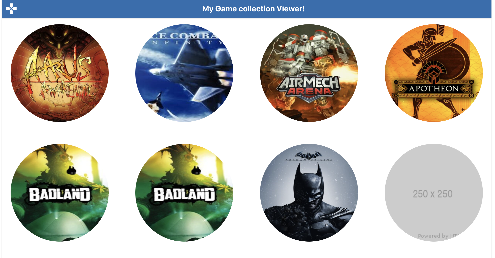

# My Game collection Viewer!

## Introduction

This project uses the following techologies

- React Hooks
- Typescript

## Available Scripts

- `yarn start` - [http://localhost:3000](http://localhost:3000)
- `yarn test` - [running tests](https://facebook.github.io/create-react-app/docs/running-tests).
- `yarn build` - [deployment](https://facebook.github.io/create-react-app/docs/deployment).
- `yarn eject` - This command will remove the single build dependency from your project.

## Testing

- Place `debugger;` statements in any test and run:

`$ npm run test:debug``

- This will start running your Jest tests, but pause before executing to allow a debugger to attach to the process.
- Open the following in Chrome

`about:inspect`

- After opening that link, the Chrome Developer Tools will be displayed. Select **inspect** on your process and a breakpoint will be set at the first line of the react script.

## Links of interest

- [Chackra UI](https://chakra-ui.com/)
- [React Icons](https://react-icons.github.io/react-icons)
