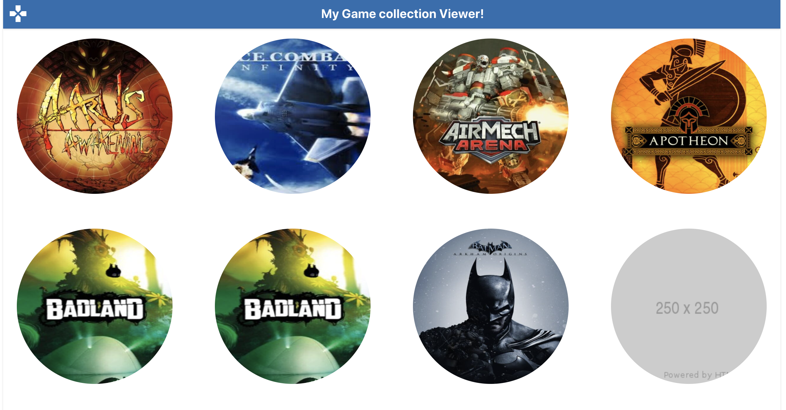

# My Game collection Viewer!



## Introduction

This project uses the following technologies:

- React Hooks
- TypeScript
- Chakra UI
- Vite (dev server and build)
- Vitest + Testing Library (tests)

## Getting Started

Use Node.js 22 and npm. If you use nvm, select the version pinned in `.nvmrc` from this directory:

```sh
nvm use
```

From this directory, install dependencies and start the development server:

```sh
npm i
npm start
```

## Available Scripts

- `npm start` - Starts the Vite dev server at [http://localhost:3000](http://localhost:3000).
- `npm test` - Runs tests in watch mode ([Vitest](https://vitest.dev/)).
- `npm run test:coverage` - Runs the tests once and collects coverage.
- `npm run build` - Type-checks and creates a production build in `build/`.
- `npm run preview` - Serves the production build locally.

## Testing

- Place `debugger;` statements in any test and run:

`npm run test:debug`

- This starts Vitest in a single worker and pauses before executing so a debugger can attach.
- Open `chrome://inspect` in Chrome and select **inspect** on the process.

## Links of interest

- [Chackra UI](https://chakra-ui.com/)
- [React Icons](https://react-icons.github.io/react-icons)
